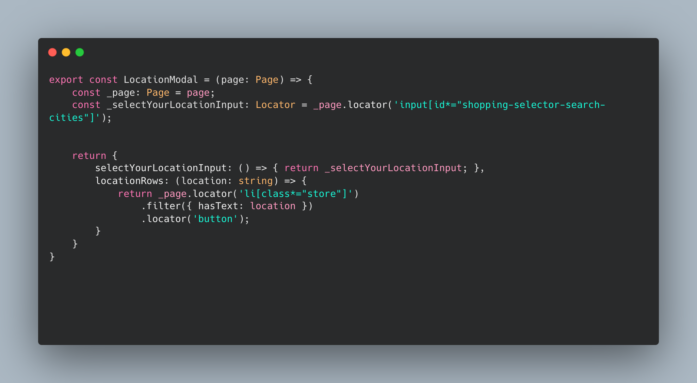

# Weggies

The purpose of this project was to learn how to enable non-technical co-workers or people the ability to execute scripts.

And also to build CSV exportable grocery shopping lists specifically for Wegmans (hence the name, Weggies). The shopping lists consists of product name, aisle where the product is located and current price of the item. This data is heavily reliant on Wegmans keeping up to date with their current prices and locations so bear in mind there may be some error if you actually use one of the generated shopping lists. It should also be noted that this is using [PlaywrightJS](https://playwright.dev/) which relies on Wegman's frontend for scraping. So this project has a high chance of being flaky, but when it works...it works 🙂

## Architecture
Scraper:
- [PlaywrightJS](https://playwright.dev/)
- [Docker](https://www.docker.com/)
- [Chromium](https://www.chromium.org/chromium-projects/)

End User UI:
- [AirplaneJS](https://docs.airplane.dev/)
- [ReactJS](https://react.dev/)

## Code Design Paradigm

This project uses a combination of Functional based [POM](https://www.browserstack.com/guide/page-object-model-in-selenium#:~:text=Page%20Object%20Model%2C%20also%20known,application%20as%20a%20class%20file.) + [Composite theory](https://x-team.com/blog/understanding-the-composite-pattern/#:~:text=The%20composite%20pattern%20organizes%20code,them%20up%20into%20larger%20ones.) + [mixin design](https://www.patterns.dev/posts/mixin-pattern)

Essentially, this is your typical page object model code design, but in a functional manner. This explores using functions to hold CSS selectors + interactions with the page rather than object oriented classes. The thought process behind this is functions compile faster than objects so this will help performance and the overall dev experience.

Examples of this can be found [here](https://github.com/Khrove/bequa/blob/main/pages/Search.page.ts)

## Why Docker?

There really is no use for Docker in this project, it was included as a means of practicing with PlaywrightJS + Docker but the thought process here is that anyone can pull down this repo to their machine, install the dependencies and execute the code. They do not need to have Chromium, webkit, or firefox installed on their machine and this will "just work."

## Why AirplaneJS?

[AirplaneJS](https://www.airplane.dev/)

After designing the initial method of scraping I asked myself, "okay cool, I can build a grocery list for myself. But how can I enable this to be easily executable by non-technical or people who lack the tools to run this on their machine?" This became especially prevalent when you thought about running this application in an environment where people could not easily install tools on their machine.

AirplaneJS provides a relatively low learning curve solution to this problem. Pre-existing ReactJS knowledge is required as this framework follows their functional component way of doing things + useEffect and component states.

Examples of how to run PlaywrightJS in an airplane task can be found [here](https://github.com/Khrove/bequa/blob/main/tasks/create_grocery.airplane.ts) 
Exampels of how to create an AirplaneJS view can be found [here](https://github.com/Khrove/bequa/blob/main/weggies.airplane.view.tsx)

## Author
Joshua Johnson
08/22/2023